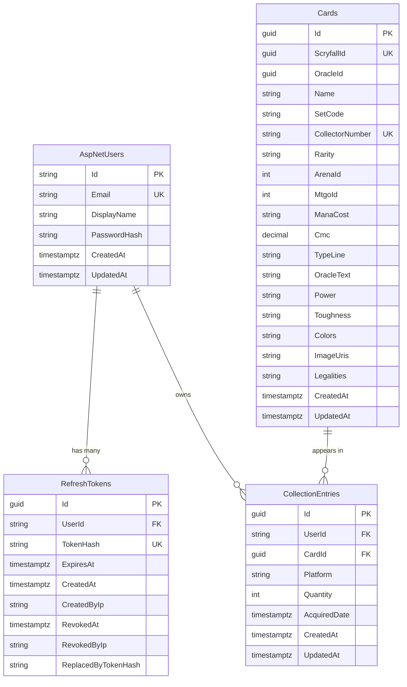

# Database Schema Documentation

This document describes the database schema for the MTG Collection Tracker application.

**Database**: PostgreSQL (Azure Database for PostgreSQL - Flexible Server in production)
**ORM**: Entity Framework Core 10 with Npgsql provider
**Migrations**: Located in `src/backend/MTGCollectionTracker.Data/Migrations/`

---

## Entity Relationship Diagram



**Key Relationships:**

- **User → RefreshTokens**: One-to-many. Users can have multiple active refresh tokens (multi-device support).
- **User → CollectionEntries**: One-to-many. Users own cards across multiple platforms.
- **Card → CollectionEntries**: One-to-many. Same card can appear in multiple users' collections.
- **Composite Uniqueness**: (UserId, CardId, Platform) ensures users can't have duplicate entries.

**Important Indexes:**

- `AspNetUsers.Email` - Fast login lookups
- `RefreshTokens.TokenHash` - Fast token validation
- `RefreshTokens.UserId` - Find user's tokens for revocation
- `Cards.ScryfallId` - Unique constraint, fast Scryfall lookups
- `Cards.OracleId` - Find all printings of same card
- `Cards.Name` - Fast card search
- `Cards(SetCode, CollectorNumber)` - Unique constraint per printing
- `CollectionEntries.UserId` - Fast collection retrieval
- `CollectionEntries(UserId, Platform)` - Optimized platform filtering
- `CollectionEntries(UserId, CardId, Platform)` - Prevent duplicates

---

## Conventions

- **Timestamps**: All timestamps are stored as `timestamp with time zone` (PostgreSQL's `timestamptz`), which stores values internally as UTC. Always use `DateTime.UtcNow` in application code.
- **Primary Keys**: String GUIDs for user-related tables (Identity convention), UUID for application entities.
- **Naming**: Tables use PascalCase (EF Core default). Consider switching to snake_case for PostgreSQL convention in future.
- **Soft Deletes**: Not implemented initially. May add `DeletedAt` columns later if needed.

---

## Identity Tables (ASP.NET Core Identity)

These tables are managed by ASP.NET Core Identity and provide authentication/authorization infrastructure.

### AspNetUsers

The main user account table. Extends `IdentityUser` with custom application fields.

| Column                 | Type         | Nullable | Description                                                                   |
| ---------------------- | ------------ | -------- | ----------------------------------------------------------------------------- |
| `Id`                   | text         | NO       | Primary key. GUID as string (Identity convention).                            |
| `UserName`             | varchar(256) | YES      | Login identifier. Must be unique. Used for authentication.                    |
| `NormalizedUserName`   | varchar(256) | YES      | Uppercase version of UserName for case-insensitive lookups.                   |
| `Email`                | varchar(256) | YES      | User's email address. Must be unique per our configuration.                   |
| `NormalizedEmail`      | varchar(256) | YES      | Uppercase version of Email for case-insensitive lookups.                      |
| `EmailConfirmed`       | boolean      | NO       | Whether email has been verified. Default: false.                              |
| `PasswordHash`         | text         | YES      | BCrypt hash of user's password. Null for external login only users.           |
| `SecurityStamp`        | text         | YES      | Random value that changes when credentials change. Used to invalidate tokens. |
| `ConcurrencyStamp`     | text         | YES      | Used for optimistic concurrency. Changes on each update.                      |
| `PhoneNumber`          | text         | YES      | Optional phone number. Not used in MVP.                                       |
| `PhoneNumberConfirmed` | boolean      | NO       | Whether phone has been verified. Default: false.                              |
| `TwoFactorEnabled`     | boolean      | NO       | Whether 2FA is enabled. Default: false. Not used in MVP.                      |
| `LockoutEnd`           | timestamptz  | YES      | When lockout expires. Null if not locked out.                                 |
| `LockoutEnabled`       | boolean      | NO       | Whether account can be locked out. Default: true.                             |
| `AccessFailedCount`    | integer      | NO       | Number of failed login attempts. Resets on successful login.                  |
| `DisplayName`          | text         | YES      | **Custom field.** Friendly name shown in UI (can differ from UserName).       |
| `CreatedAt`            | timestamptz  | NO       | **Custom field.** When account was created. Default: NOW().                   |
| `UpdatedAt`            | timestamptz  | NO       | **Custom field.** When profile was last modified. Default: NOW().             |

**Indexes:**

- `UserNameIndex` - Unique index on `NormalizedUserName` for fast login lookups
- `EmailIndex` - Index on `NormalizedEmail` for email lookups
- `IX_AspNetUsers_DisplayName` - Index on `DisplayName` for potential search

---

### AspNetRoles

Role definitions for role-based access control (RBAC).

| Column             | Type         | Nullable | Description                                     |
| ------------------ | ------------ | -------- | ----------------------------------------------- |
| `Id`               | text         | NO       | Primary key. GUID as string.                    |
| `Name`             | varchar(256) | YES      | Role name (e.g., "Admin", "User").              |
| `NormalizedName`   | varchar(256) | YES      | Uppercase version for case-insensitive lookups. |
| `ConcurrencyStamp` | text         | YES      | Optimistic concurrency token.                   |

**Indexes:**

- `RoleNameIndex` - Unique index on `NormalizedName`

**Note**: We may not use roles in MVP. Simple user/admin distinction can use claims instead.

---

### AspNetUserRoles

Junction table linking users to roles (many-to-many).

| Column   | Type | Nullable | Description          |
| -------- | ---- | -------- | -------------------- |
| `UserId` | text | NO       | FK to AspNetUsers.Id |
| `RoleId` | text | NO       | FK to AspNetRoles.Id |

**Primary Key**: Composite (`UserId`, `RoleId`)

---

### AspNetUserClaims

Custom claims attached to individual users. Claims are key-value pairs that represent user attributes or permissions.

| Column       | Type    | Nullable | Description                                                 |
| ------------ | ------- | -------- | ----------------------------------------------------------- |
| `Id`         | integer | NO       | Auto-incrementing primary key.                              |
| `UserId`     | text    | NO       | FK to AspNetUsers.Id                                        |
| `ClaimType`  | text    | YES      | Claim identifier (e.g., "subscription_tier", "can_export"). |
| `ClaimValue` | text    | YES      | Claim value (e.g., "premium", "true").                      |

**Example Uses**:

- Premium subscription status
- Feature flags per user
- Custom permissions not tied to roles

---

### AspNetRoleClaims

Claims attached to roles. All users in a role inherit these claims.

| Column       | Type    | Nullable | Description                    |
| ------------ | ------- | -------- | ------------------------------ |
| `Id`         | integer | NO       | Auto-incrementing primary key. |
| `RoleId`     | text    | NO       | FK to AspNetRoles.Id           |
| `ClaimType`  | text    | YES      | Claim identifier.              |
| `ClaimValue` | text    | YES      | Claim value.                   |

---

### AspNetUserLogins

External login provider associations (Google, Microsoft, etc.). Not used in MVP.

| Column                | Type | Nullable | Description                                  |
| --------------------- | ---- | -------- | -------------------------------------------- |
| `LoginProvider`       | text | NO       | Provider name (e.g., "Google", "Microsoft"). |
| `ProviderKey`         | text | NO       | User's unique ID from the provider.          |
| `ProviderDisplayName` | text | YES      | Friendly name for the provider.              |
| `UserId`              | text | NO       | FK to AspNetUsers.Id                         |

**Primary Key**: Composite (`LoginProvider`, `ProviderKey`)

---

### AspNetUserTokens

Stores tokens for various purposes (password reset, 2FA, refresh tokens if stored in DB).

| Column          | Type | Nullable | Description                                            |
| --------------- | ---- | -------- | ------------------------------------------------------ |
| `UserId`        | text | NO       | FK to AspNetUsers.Id                                   |
| `LoginProvider` | text | NO       | Token provider (e.g., "[AspNetUserStore]").            |
| `Name`          | text | NO       | Token name (e.g., "RefreshToken", "AuthenticatorKey"). |
| `Value`         | text | YES      | The token value.                                       |

**Primary Key**: Composite (`UserId`, `LoginProvider`, `Name`)

---

## Application Tables

### Cards

Card metadata synced from Scryfall. Expected to contain ~111,000 rows when fully populated.

Each Card represents a specific printing of a card (e.g., Lightning Bolt from M21 is a different Card than Lightning Bolt from ZNR). Cards with the same name share an `OracleId` but have unique `ScryfallId` values.

| Column            | Type        | Nullable | Description                                                                                                                       |
| ----------------- | ----------- | -------- | --------------------------------------------------------------------------------------------------------------------------------- |
| `Id`              | uuid        | NO       | Primary key. GUID generated by our database.                                                                                      |
| `ScryfallId`      | uuid        | NO       | Scryfall's unique identifier for this specific printing. **Unique constraint.**                                                   |
| `OracleId`        | uuid        | NO       | Links all printings of the same card. All Lightning Bolts share the same OracleId.                                                |
| `Name`            | text        | NO       | Card name (e.g., "Lightning Bolt").                                                                                               |
| `SetCode`         | text        | NO       | Set code (e.g., "m21", "znr"). Part of unique constraint with CollectorNumber.                                                    |
| `CollectorNumber` | text        | NO       | Collector number (e.g., "123", "45a"). Can contain letters. Part of unique constraint.                                            |
| `Rarity`          | text        | NO       | Card rarity: "common", "uncommon", "rare", "mythic", "special", "bonus".                                                          |
| `ArenaId`         | integer     | YES      | MTG Arena GrpId. Only ~16,000 cards have this. Null if not available on Arena.                                                    |
| `MtgoId`          | integer     | YES      | Magic Online card ID. Null if not available on MTGO.                                                                              |
| `ManaCost`        | text        | YES      | Mana cost in Scryfall notation (e.g., "{2}{U}{U}"). Null for lands.                                                               |
| `Cmc`             | numeric     | NO       | Converted mana cost (mana value). 0.0 for lands. Can be fractional for Un-set cards.                                              |
| `TypeLine`        | text        | NO       | Card type line (e.g., "Creature — Human Wizard", "Instant").                                                                      |
| `OracleText`      | text        | YES      | Oracle rules text. Null for cards with no rules text (e.g., basic lands).                                                         |
| `Power`           | text        | YES      | Creature power. Can be non-numeric (e.g., "_", "1+_"). Null for non-creatures.                                                    |
| `Toughness`       | text        | YES      | Creature toughness. Can be non-numeric (e.g., "_", "2+_"). Null for non-creatures.                                                |
| `Colors`          | text (JSON) | YES      | JSON array of color codes: `["W","U","B","R","G"]`. Stored as text, consider JSONB later.                                         |
| `ImageUris`       | text (JSON) | YES      | JSON object with Scryfall CDN image URLs: `{"small":"url","normal":"url","large":"url"}`.                                         |
| `Legalities`      | text (JSON) | YES      | JSON object with format legality: `{"standard":"legal","modern":"banned"}`. Values: "legal", "not_legal", "restricted", "banned". |
| `CreatedAt`       | timestamptz | NO       | When this card was added to database. Default: NOW().                                                                             |
| `UpdatedAt`       | timestamptz | NO       | When this card was last updated from Scryfall. Default: NOW().                                                                    |

**Indexes:**

- `PK_Cards` - Primary key on `Id`
- `IX_Cards_ScryfallId` - **Unique** index for fast Scryfall lookups and preventing duplicates
- `IX_Cards_SetCode_CollectorNumber` - **Unique composite** index (ensures one card per set+collector combo)
- `IX_Cards_OracleId` - Find all printings of the same card
- `IX_Cards_Name` - Fast card name search
- `IX_Cards_ArenaId` - **Partial index** (only where ArenaId IS NOT NULL) for Arena imports
- `IX_Cards_MtgoId` - **Partial index** (only where MtgoId IS NOT NULL) for MTGO imports

**Foreign Keys:**

- None (this is a reference table)

**Navigation Properties:**

- `CollectionEntries` - One-to-many relationship to collection ownership records

**Future Enhancements:**

- Add `Finishes` field (foil/nonfoil/etched tracking after researching Scryfall data)
- Add `Prices` field (TCGPlayer/CardKingdom pricing data, Phase 4+)

---

### CollectionEntries

Represents a user's ownership of a specific card on a specific platform. Each entry tracks how many copies of a particular card printing a user owns (Paper, Arena, or MTGO).

**Business Rule:** A user can only have one CollectionEntry per (UserId, CardId, Platform) combination. To add more copies, update the `Quantity` field.

| Column         | Type        | Nullable | Description                                                                                   |
| -------------- | ----------- | -------- | --------------------------------------------------------------------------------------------- |
| `Id`           | uuid        | NO       | Primary key. GUID generated by our database.                                                  |
| `UserId`       | text        | NO       | Foreign key to AspNetUsers.Id. The user who owns this card.                                   |
| `CardId`       | uuid        | NO       | Foreign key to Cards.Id. The specific printing being owned.                                   |
| `Platform`     | text        | NO       | Where this card is owned: "Paper", "Arena", or "Mtgo". Stored as string (enum serialization). |
| `Quantity`     | integer     | NO       | How many copies owned (1-999). Currently combines all finishes (foil/nonfoil/etched).         |
| `AcquiredDate` | timestamptz | YES      | When this card was acquired. Null if not tracked or unknown.                                  |
| `CreatedAt`    | timestamptz | NO       | When this collection entry was created. Default: NOW().                                       |
| `UpdatedAt`    | timestamptz | NO       | When this collection entry was last modified. Default: NOW().                                 |

**Indexes:**

- `PK_CollectionEntries` - Primary key on `Id`
- `IX_CollectionEntries_UserId` - Fast collection retrieval for a user
- `IX_CollectionEntries_UserId_Platform` - **Composite index** for filtering by platform (e.g., "show me my Arena collection")
- `IX_CollectionEntries_UserId_CardId_Platform` - **Composite index** for enforcing uniqueness and fast lookups
- `IX_CollectionEntries_CardId` - Find which users own a specific card
- `IX_CollectionEntries_Platform` - Platform-wide statistics

**Foreign Keys:**

- `FK_CollectionEntries_AspNetUsers_UserId` - CASCADE DELETE (delete user → delete their collection)
- `FK_CollectionEntries_Cards_CardId` - CASCADE DELETE (delete card → delete ownership records)

**Navigation Properties:**

- `User` - Many-to-one relationship to ApplicationUser
- `Card` - Many-to-one relationship to Card

**Future Enhancements:**

- Add location/container tracking (Phase 6 - Decklist Management)
  - Track which deck/binder/box the card is in
  - Separate Container and ContainerEntry entities
  - Unallocated vs allocated quantity tracking
- Split `Quantity` into `Quantity`, `FoilQuantity`, `EtchedQuantity` (if needed after Scryfall research)

---

## Future Tables

These tables will be added as we build additional features.

### Decklists (Phase 6)

User's saved decklists.

```
Planned columns: id, user_id, name, format, platform, description, is_public,
created_at, updated_at
```

### DecklistEntries (Phase 6)

Cards in a decklist.

```
Planned columns: id, decklist_id, card_id, quantity, is_sideboard, is_commander,
category, created_at
```

### ImportHistory (Phase 4)

Track collection import operations.

```
Planned columns: id, user_id, platform, import_type, source, cards_added,
cards_removed, cards_updated, file_name, imported_at
```

---

## Migration History

| Migration                          | Date       | Description                                                  |
| ---------------------------------- | ---------- | ------------------------------------------------------------ |
| `InitialIdentity`                  | 2026-01-19 | ASP.NET Core Identity tables + custom user fields            |
| `AddRefreshTokens`                 | 2026-02-13 | RefreshTokens table for JWT refresh token rotation           |
| `AddCardAndCollectionEntities`     | 2026-02-14 | Cards and CollectionEntries tables with indexes              |
| `AddCompositeIndexForUserPlatform` | 2026-02-14 | Performance optimization: (UserId, Platform) composite index |

---

## Common Queries

### Find user by username (login)

```sql
SELECT * FROM "AspNetUsers"
WHERE "NormalizedUserName" = UPPER('username');
```

### Check if user is locked out

```sql
SELECT "LockoutEnd" > NOW() AS is_locked
FROM "AspNetUsers"
WHERE "Id" = 'user-guid';
```

### Get user with roles

```sql
SELECT u."UserName", r."Name" as "Role"
FROM "AspNetUsers" u
LEFT JOIN "AspNetUserRoles" ur ON u."Id" = ur."UserId"
LEFT JOIN "AspNetRoles" r ON ur."RoleId" = r."Id"
WHERE u."Id" = 'user-guid';
```

## Common Application Queries

### Get user's collection count by platform

```sql
SELECT "Platform", SUM("Quantity") as "TotalCards"
FROM "CollectionEntries"
WHERE "UserId" = 'user-guid'
GROUP BY "Platform";
```

### Find all users who own a specific card

```sql
SELECT u."Email", ce."Platform", ce."Quantity"
FROM "CollectionEntries" ce
JOIN "AspNetUsers" u ON ce."UserId" = u."Id"
WHERE ce."CardId" = 'card-guid';
```

### Search cards by name (case-insensitive)

```sql
SELECT "Id", "Name", "SetCode", "CollectorNumber", "Rarity"
FROM "Cards"
WHERE "Name" ILIKE '%lightning%'
ORDER BY "Name", "SetCode"
LIMIT 50;
```

### Get collection entries with card details (paginated)

```sql
SELECT
    c."Name",
    c."SetCode",
    c."CollectorNumber",
    c."Rarity",
    ce."Platform",
    ce."Quantity",
    ce."AcquiredDate"
FROM "CollectionEntries" ce
JOIN "Cards" c ON ce."CardId" = c."Id"
WHERE ce."UserId" = 'user-guid'
  AND ce."Platform" = 'Arena'
ORDER BY c."Name", c."SetCode"
LIMIT 50 OFFSET 0;
```

---

**Last Updated**: February 14, 2026
**Next Update**: When Decklists/ImportHistory tables are added (Phase 4-6

**Last Updated**: January 19, 2026
**Next Update**: When Cards/Collections tables are added (Phase 3)
